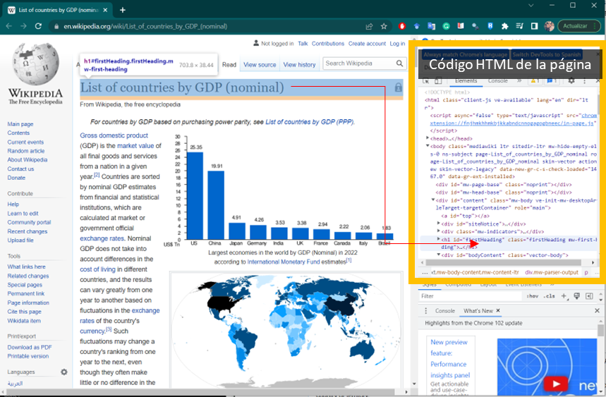
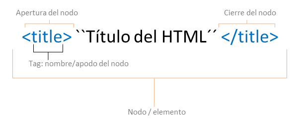

Code Book ver 2.0
================
2022-07-03

# Fundamentos de Web-scraping en R

*Web scraping* o web harvesting hace referencia al conjutno de técnicasl
empleadas para extraer información en la wed que no esta necesariamente
empaquetada en un objeto o archivo consumible de manera directa .

``` r
# libreiras
library(dplyr)
library(rvest) # para web scraping
library(ggplot2)
```

## Estructura de un HTML

Los documentos **HTML** (*Hypert Text Markup*) son archivos
estructurados que contienen una semántica regular, y son los que por lo
general podemos observar detrás de las páginas web (la mayoria de
ellas). Si dentro de una págian web damos “click secudnario” y luego
“inspecionar” (o tambien “**Ctrl+u**”), podemos ver con clairdad el
documetno HTMl detras de ella.

<p align="center">

</p>

HTML como lenguaje de porgramación tiene una sintaxis y una estructura
lógica. Una muestra de esto es que cada uno de los **elementos** de una
documento HTML esta **encapsulado** en un “**nodo**”. Por ejemplo, el
título de un documento HTML esta codificado así:
`<title>"Un gran titulo"</titile>` en donde `<title>` es el nodo del
titulo. Esta estructura de “nodos” nos permite detectar patrones y
elementos puntuales dentro de estos documentos.

<p align="center">

</p>

Algunos elementos con sus tespectivos “***tags***” (nombre del nodo)
comúnes en un documento HTML son:

-   `<!DOCTYPE html>` : Declaración del tipo de docuento (en este caso
    un HTML)

-   `<head>` : Contiene metadata sobre la pagina HTML

-   `<title>` : El titulo de la pagina en cuestion (el que finalmente se
    muestra en el buscador/browser)

-   `<body>` :

Otros tags comunes son `<table>`, `<fig>`, `<table>`, `<table>`, etc…

## Web scraping de tablas

En este ejemplo utilizaremos la página web de [Wilkipedia del PIB
(Prodcucto Interno Bruto) por
paises](https://en.wikipedia.org/wiki/List_of_countries_by_GDP_(nominal) "¡Haz click aqui!"),
para emplear las técnicas básicas de web scrping en **R**.

``` r
# 1. Leemos el link a explorar

h <- read_html("https://en.wikipedia.org/wiki/List_of_countries_by_GDP_(nominal)")
class(h)
```

    ## [1] "xml_document" "xml_node"
