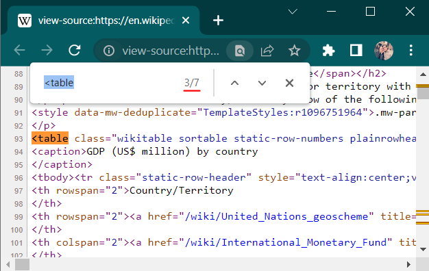

Code Book ver 2.0
================
Guibor Camargo (<guibor.camargo@urosario.edu.co>)\|\|
2022-07-03

# Introducción

Este guía es para aprender nociones básicas e intermedias de análisis de
datos **R**. La intención es guíar al lector de manera consitente y
resumida por alguas de las principales técnias en ciencia de datos y
econometría en **R**. De esta manera, no se asume nada (o casi nada)
sobre el lector: es decir, es una guía tanto para principiantes como
para usuarios con conocimientos previos en programación y/o
estadísticas.

#### Contenidos:

-   [“Regex” manejo
    básico](https://github.com/Guibi1994/Code-Book-R-/blob/main/00_Code_Book_2.0.md#regex-manejo-b%C3%A1sico)

-   [Fundamentos de Web-scraping en
    R](https://github.com/Guibi1994/Code-Book-R-/blob/main/00_Code_Book_2.0.md#fundamentos-de-web-scraping-en-r)

    -   [Estructura de un HTML (lo que hay que
        saber)](https://github.com/Guibi1994/Code-Book-R-/blob/main/00_Code_Book_2.0.md#estructura-de-un-html-lo-que-hay-que-saber)

    -   [Web scraping de
        tablas](https://github.com/Guibi1994/Code-Book-R-/blob/main/00_Code_Book_2.0.md#web-scraping-de-tablas)

    -   Web scraping de páginas

    -   Web scrapping de múltiples páginas (páginas anidadas)

    -   Web scrapping en páginas de consultas

    -   Cuando hay un “captcha”

    -   Web scraping en entórnos de JavaCript

-   [Notas sobre Data
    wrangling](https://github.com/Guibi1994/Code-Book-R-/blob/main/00_Code_Book_2.0.md#notas-sobre-datawrangling)

# “Regex” manejo básico

“Regex” es una sintáxis universal de textos. Es básicamente una lenguaje
común, en muchos entornos de programación, que se emplea para hacer
consultas dentro de un texto o “string”. En “regex” cada letra, espacio,
simbolo o número es un **caracter independiente** y tiene una manera
difernte de consultarse. El conocimiento básico de esta sintáxis para el
manejo de textos, es uno de los pilares fundamentales de otras técnicas
como “text mining”, “web-scraping” y “sentiment analysis” entre otras.
Lo mostrado aca se base principalmente en las clases de [análisis de
textos del curso edX de la Universidad de Harvard en Data
Science](https://rafalab.github.io/dslibro/procesamiento-de-cadenas.html "Contulte acá el capítulo de manejo de textos de ese curso")

``` r
# Liberria principal
library(stringr)

# Librerias complementarias
library(dplyr) # Manejo de bases de datos
library(tidyr) # Manejo de bases de datos
```

# Fundamentos de Web-scraping en R

*Web scraping* o web harvesting hace referencia al conjutno de técnicasl
empleadas para extraer información en la wed que no esta necesariamente
empaquetada en un objeto o archivo consumible de manera directa .

``` r
# libreira principal
library(rvest) # Para web scraping

# librerias complementarias
library(dplyr) # Manejo de bases de datos
library(tidyr) # Manejo de bases de datos
library(ggplot2) # Creaicón de gráficas
```

## Estructura de un HTML (lo que hay que saber)

Los documentos **HTML** (*Hypert Text Markup*) son archivos
estructurados que contienen una semántica regular, y son los que por lo
general podemos observar detrás de las páginas web (la mayoria de
ellas). Si dentro de una págian web damos “click secudnario” y luego
“inspecionar” (o tambien “**Ctrl+u**”), podemos ver con clairdad el
documetno HTML detras de ella.

<p align="center">

</p>

HTML como lenguaje de porgramación tiene una sintaxis y una estructura
lógica. Una muestra de esto es que cada uno de los **elementos** de una
documento HTML esta **encapsulado** en un “**nodo**”. Por ejemplo, el
título de un documento HTML esta codificado así:
`<title>"Un gran titulo"</titile>` en donde `<title>` es el nodo del
titulo. Esta estructura de “nodos” nos permite detectar patrones y
elementos puntuales dentro de estos documentos.

<p align="center">

</p>

Algunos elementos con sus tespectivos “***tags***” (nombre del nodo)
comúnes en un documento HTML son:

-   `<!DOCTYPE html>` : Declaración del tipo de docuento (en este caso
    un HTML)

-   `<head>` : Contiene metadata sobre la pagina HTML

-   `<title>` : El título de la pagina en cuestion (el que finalmente se
    muestra en el buscador/browser)

-   `<body>` :El contiendo de la página en cuestión.

Otros tags comunes son `<p>`(para denominar parrafos), `<table>`(para
denominar tablas), ``(para denominar imágenes), `<map>`(para
denóminar mapas), etc… [En el éste enlace puedes ver una lista de tagas
comúnes en un documento
HTML](https://www.w3schools.com/TAgs/default.asp "Tags de referencia").

## Web scraping de tablas

En este ejemplo utilizaremos la página web de [Wilkipedia del PIB
(Prodcucto Interno Bruto) por
paises](https://en.wikipedia.org/wiki/List_of_countries_by_GDP_(nominal) "¡Haz click aqui!"),
para emplear las técnicas básicas de web scrping en **R**. Los pasos a
seguir asumen que ya instalamos y cargamos la libreria Rvest:
`library(rvest)`

1.  Extraemos la URL (el *link*) de la página en donde se encutra
    nuestra tabla

2.  Con la función `read_html` podemos leer el archivo HTML detrás del
    link. Este será leido como un arichivo tipo XML en forma de *lista*
    de elementos.

    ``` r
    PIB_paises <- read_html("https://en.wikipedia.org/wiki/List_of_countries_by_GDP_(nominal)")
    ```

3.  El siguiente paso, consite en utilizar el comando `html_nodes` ( OJO
    “nodes” no “node”) para buscar el nodo que nos interesa. En este
    caso el nodo que nos interesa es `<table>` por que estamos
    extrallendo directamente una tabla del documento HTML. Basicamente
    estamos solicitando filtrar todos los nodos y solo quedarnos con
    aquellos cuyo ***tag*** sea “table”, y estos quedara guardados en
    una *lista.*

    ``` r
    PIB_paises <- PIB_paises %>% html_nodes("table")
    ```

4.  El siguiente paso puede ser un poco engañoso. Una vez extraigamos el
    nodo “table”, realmente estamos extrallendo no uno, sino todos los
    nodos llamados “table” presentes en el documento HTML. En nuestro
    caso, podemos ver cómo una vez extremos el nodo “table” tenemos un
    total de 7 nodos con ese nombre ¿cuál es el número del nodo que nos
    interesa?

    Para saberlo podemos inspeccionar la página (**Ctrl+u**) y buscar
    (**Ctrl+f**) “\<table”, y luego deteminar cuál es el número del nodo
    “table” que da apertura a la tabla que nos interesa extraer. Otra
    forma es con prueba y error, pero es más efectivo de la primera
    manera. En nuestro ejemplo (como se ve a continuación), el nodo \#3
    que encontramos en el documento HTML el que da apertura a la tabla
    que nos interesa extraer.

    <p align="center">

    

    </p>

    En nuestro ejemplo (como se en la imágen anterior), el **3*er*
    nodo** que encontramos en el documento HTML, es el que da apertura a
    la tabla que nos interesa extraer.

    :gift: **TIP** :gift:**:** En algunos casos, dentro del código HTML
    las tablas tiene un “id” despues del *tag*: (ejm)
    `<table id="Nombre_tabla">` . En estos casos podemos usar el comando
    `html_nodes("table#Nombre_tabla")` para extraer específicamente la
    tabla que queremos. Sin embargo en este caso (como un muchos) no
    existe esta posilidad por la falta de un indentficador específico de
    la tabla.

5.  Ya sabemos que 3*er* elemento en nuestra lista es el nodo que
    contiene una **tabla** que nos interesa. Lo siguiente es usar el
    comando `html_table()` para especificar que es un nodo “tipo tabla”,
    y extraer 3er nodo posteriormente (podemo utilizar la sintáxis
    básica de R para indicar la consulta del 3er elemento de la lista:
    `[[3]]` o tambien `[3]` ). Podemos tambien de una vez en el mismo
    paso converir el resultado a una “data.frame” y/o a un “tible”.

    ``` r
    PIB_paises <- PIB_paises %>% 
      # Leer la/s tabla/s del documento HTML
      html_table() %>%
      # Acceder el 3er elemento de la lista
      .[[3]] %>% 
      # Cambiar a formato de base de datos
      as.data.frame()

    head(PIB_paises,5)
    ```

        ##   Country/Territory UN Region IMF[1][12] IMF[1][12] United Nations[13]
        ## 1 Country/Territory UN Region   Estimate       Year           Estimate
        ## 2             World         - 93,863,851       2021         87,461,674
        ## 3     United States  Americas 25,346,805       2022         20,893,746
        ## 4             China      Asia 19,911,593  [n 2]2022         14,722,801
        ## 5             Japan      Asia  4,912,147       2022          5,057,759
        ##   United Nations[13] World Bank[14][15] World Bank[14][15]
        ## 1               Year           Estimate               Year
        ## 2               2020         84,705,567               2020
        ## 3               2020         20,936,600               2020
        ## 4          [n 3]2020         14,722,731               2020
        ## 5               2020          4,975,415               2020

6.  :recycle: **RESUMEN:** Ya los pasos siguientes son realizar los
    arreglos correspondientes que se tengan que hacer para cada paso
    puntual. Pero ya extraimos la información. Incluso podemos hacer
    todo en una sola línea de código

    ``` r
    PIB_paises <- 
      # 1. Leer HTML desde la URL
      read_html("https://en.wikipedia.org/wiki/List_of_countries_by_GDP_(nominal)") %>% 
      # 2. Extrer nodos llamados "table"
      html_nodes("table") %>% 
      # 3. Convertir a formato tabla
      html_table() %>% 
      # 4. Extaer el elemnto de interes
      .[[3]] %>% 
      # 5. Transformar a una base de datos
      as.data.frame() %>% 


      # - - - - - - - - - - - -
      # Pasos EXTRA: Limpiar un poco la base (cada caso es particular)
      janitor::row_to_names(row_number = 1) %>% 
      rename(Pais = 1,Region = 2, PIB_FMI=3,p_FMI=4,PIB_ONU=5,p_ONU=6,PIB_BM = 7,
             p_BM = 8) %>% 
      mutate(across(PIB_FMI:p_BM,~gsub(",","",.))) %>% as_tibble()

    PIB_paises
    ```

        ## # A tibble: 217 x 8
        ##    Pais           Region   PIB_FMI  p_FMI     PIB_ONU  p_ONU     PIB_BM   p_BM 
        ##    <chr>          <chr>    <chr>    <chr>     <chr>    <chr>     <chr>    <chr>
        ##  1 World          -        93863851 2021      87461674 2020      84705567 2020 
        ##  2 United States  Americas 25346805 2022      20893746 2020      20936600 2020 
        ##  3 China          Asia     19911593 [n 2]2022 14722801 [n 3]2020 14722731 2020 
        ##  4 Japan          Asia     4912147  2022      5057759  2020      4975415  2020 
        ##  5 Germany        Europe   4256540  2022      3846414  2020      3806060  2020 
        ##  6 India          Asia     3534743  2022      2664749  2020      2622984  2020 
        ##  7 United Kingdom Europe   3376003  2022      2764198  2020      2707744  2020 
        ##  8 France         Europe   2936702  2022      2630318  2020      2603004  2020 
        ##  9 Canada         Americas 2221218  2022      1644037  2020      1643408  2020 
        ## 10 Italy          Europe   2058330  2022      1888709  2020      1886445  2020 
        ## # ... with 207 more rows

## Web scraping de páginas

## Web scrapping de múltiples páginas (páginas anidadas)

## Web scrapping en páginas de consultas

### Cuando hay un “captcha”

## Web scraping en entórnos de JavaCript

# Notas sobre Data wrangling

``` r
#  Base inicial
nivel_edu <- data.frame(
  region = "America latina",
  pais = c(sample("Colombia",5,T),sample("Peru",5,T),sample("Venezuela",5,T)),
  materia = c("matematicas","lenguaje", "ingles", "fisica", "quimica"),
  p_2014 = rnorm(15,50,15),
  p_2016 = rnorm(15,55,10),
  p_2018 = rnorm(15,54,13),
  p_2020 = rnorm(15,61,8),
  p_2022 = rnorm(15,67,19)) %>% 
  as_tibble()

nivel_edu
```

    ## # A tibble: 15 x 8
    ##    region         pais      materia     p_2014 p_2016 p_2018 p_2020 p_2022
    ##    <chr>          <chr>     <chr>        <dbl>  <dbl>  <dbl>  <dbl>  <dbl>
    ##  1 America latina Colombia  matematicas   70.2   58.7   71.7   68.1   88.0
    ##  2 America latina Colombia  lenguaje      32.2   49.7   49.2   60.5   55.8
    ##  3 America latina Colombia  ingles        43.9   56.4   52.9   53.0   71.2
    ##  4 America latina Colombia  fisica        42.2   40.7   65.8   64.6   50.4
    ##  5 America latina Colombia  quimica       52.8   67.2   68.2   56.7   70.6
    ##  6 America latina Peru      matematicas   57.5   64.1   43.6   52.5   68.9
    ##  7 America latina Peru      lenguaje      40.2   52.8   61.6   71.8   84.8
    ##  8 America latina Peru      ingles        46.2   52.9   70.2   57.3   60.7
    ##  9 America latina Peru      fisica        68.3   90.4   43.4   70.9   47.7
    ## 10 America latina Peru      quimica       35.2   40.7   50.1   37.2   73.3
    ## 11 America latina Venezuela matematicas   26.1   71.5   51.4   62.4   47.5
    ## 12 America latina Venezuela lenguaje      68.7   62.6   55.5   55.9   62.6
    ## 13 America latina Venezuela ingles        49.8   42.7   85.6   71.9   65.6
    ## 14 America latina Venezuela fisica        65.4   53.4   61.1   71.0   75.3
    ## 15 America latina Venezuela quimica       39.1   52.6   71.6   50.3   50.9

``` r
# pivot_longer() cumple la misma función de "melt()"
nivel_edu <- nivel_edu %>% 
  pivot_longer(starts_with("p_"), "periodo",values_to = "notas")
nivel_edu
```

    ## # A tibble: 75 x 5
    ##    region         pais     materia     periodo notas
    ##    <chr>          <chr>    <chr>       <chr>   <dbl>
    ##  1 America latina Colombia matematicas p_2014   70.2
    ##  2 America latina Colombia matematicas p_2016   58.7
    ##  3 America latina Colombia matematicas p_2018   71.7
    ##  4 America latina Colombia matematicas p_2020   68.1
    ##  5 America latina Colombia matematicas p_2022   88.0
    ##  6 America latina Colombia lenguaje    p_2014   32.2
    ##  7 America latina Colombia lenguaje    p_2016   49.7
    ##  8 America latina Colombia lenguaje    p_2018   49.2
    ##  9 America latina Colombia lenguaje    p_2020   60.5
    ## 10 America latina Colombia lenguaje    p_2022   55.8
    ## # ... with 65 more rows

``` r
# pivot_wider() cumple la misma función que "dcast()"
nivel_edu %>%
  pivot_wider(names_from = materia, values_from = notas)
```

    ## # A tibble: 15 x 8
    ##    region         pais      periodo matematicas lenguaje ingles fisica quimica
    ##    <chr>          <chr>     <chr>         <dbl>    <dbl>  <dbl>  <dbl>   <dbl>
    ##  1 America latina Colombia  p_2014         70.2     32.2   43.9   42.2    52.8
    ##  2 America latina Colombia  p_2016         58.7     49.7   56.4   40.7    67.2
    ##  3 America latina Colombia  p_2018         71.7     49.2   52.9   65.8    68.2
    ##  4 America latina Colombia  p_2020         68.1     60.5   53.0   64.6    56.7
    ##  5 America latina Colombia  p_2022         88.0     55.8   71.2   50.4    70.6
    ##  6 America latina Peru      p_2014         57.5     40.2   46.2   68.3    35.2
    ##  7 America latina Peru      p_2016         64.1     52.8   52.9   90.4    40.7
    ##  8 America latina Peru      p_2018         43.6     61.6   70.2   43.4    50.1
    ##  9 America latina Peru      p_2020         52.5     71.8   57.3   70.9    37.2
    ## 10 America latina Peru      p_2022         68.9     84.8   60.7   47.7    73.3
    ## 11 America latina Venezuela p_2014         26.1     68.7   49.8   65.4    39.1
    ## 12 America latina Venezuela p_2016         71.5     62.6   42.7   53.4    52.6
    ## 13 America latina Venezuela p_2018         51.4     55.5   85.6   61.1    71.6
    ## 14 America latina Venezuela p_2020         62.4     55.9   71.9   71.0    50.3
    ## 15 America latina Venezuela p_2022         47.5     62.6   65.6   75.3    50.9
