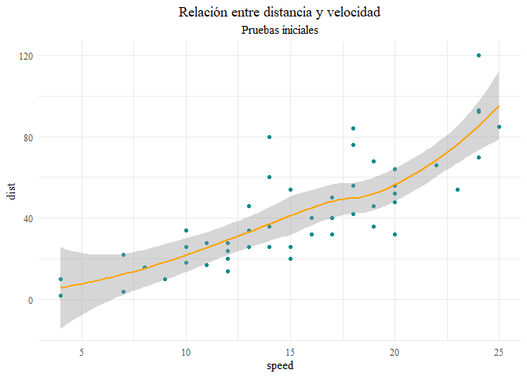

Algunas pruebas en Rmarkdown
================
Guibor Camargo
2022-06-29

# Esto quiza no se ha puteado!

*R* a veces jode un monton, que fastidio

+\epsilon_i 
")



``` r
source("prueba_ejecutable.R")
```
